Hi I am @ken-morel a pythonista looking for collaborators, prices and project.
I like coding, as tells my [wakatime](https://wakatime.com/@kenmorel), but I also like being able to help
other developers or users with self made or team made tools.

I currently work on efus. Something I aim to help better markup UI components(at least better than XML) with builtin reactivity just for you to extend.
currently looks like...
**Page.efus**
```julia
using taktk.components:Window, Frame
using tkinter.constants

Window
    Frame padding=10px pos:pack=true
        Label  text=&label_text pos:pack=true
        Button command=(click)  pos:pack=true
```
... and python code...
```python
from efus import Comp2nent

class Page(Comp2nent):
    label_text = "label "
    def click(self):
        self['label_text'] += ">"
        self.namespace.update()

component = Page.make()
root = component.render()
root.mainloop()
# or Page.make().render().mainloop()
```

... Still bulky, working on it, tomorrow.

## tools and languages 📦


## stack overflow

I sometimes browse stack overflow questions, and try editing or answerring what I can

[](https://stackoverflow.com/users/22719308/ken-morel#gh-dark-mode-only)
[](https://stackoverflow.com/users/22719308/ken-morel#gh-light-mode-only)
<!--## gists
[](https://gist.github.com/ken-morel/aa1e2aab3af5162a7fc10540d4c6b014#gh-dark-mode-only)
[](https://gist.github.com/ken-morel/aa1e2aab3af5162a7fc10540d4c6b014#gh-light-mode-only)
-->

[](https://github.com/ken-morel/pyoload#gh-dark-mode-only)
[](https://github.com/ken-morel/pyoload#gh-light-mode-only)

## 🏆 GitHub Trophies


### 🔝 Best meal
My best meal could be...

> An ubuntu flavoured beautifull python soup as that composed by wayland cooks.

Yeah, not good, workin' on it!

<!--
<div align="center">
    <a href="https://github.com/ken-morel">
        
    </a>
</div>-->


## Coding
I code mostly in python and javascript and a little go.

<!--START_SECTION:waka-->


**🐱 My GitHub Data** 

> 📦 ? Used in GitHub's Storage 
 > 
> 🚫 Not Opted to Hire
 > 
> 📜 49 Public Repositories 
 > 
> 🔑 0 Private Repositories 
 > 
**I'm an Early 🐤** 

```text
🌞 Morning                302 commits         ████░░░░░░░░░░░░░░░░░░░░░   17.27 % 
🌆 Daytime                583 commits         ████████░░░░░░░░░░░░░░░░░   33.33 % 
🌃 Evening                380 commits         █████░░░░░░░░░░░░░░░░░░░░   21.73 % 
🌙 Night                  484 commits         ███████░░░░░░░░░░░░░░░░░░   27.67 % 
```
📅 **I'm Most Productive on Friday** 

```text
Monday                   258 commits         ████░░░░░░░░░░░░░░░░░░░░░   14.75 % 
Tuesday                  186 commits         ███░░░░░░░░░░░░░░░░░░░░░░   10.63 % 
Wednesday                262 commits         ████░░░░░░░░░░░░░░░░░░░░░   14.98 % 
Thursday                 288 commits         ████░░░░░░░░░░░░░░░░░░░░░   16.47 % 
Friday                   298 commits         ████░░░░░░░░░░░░░░░░░░░░░   17.04 % 
Saturday                 172 commits         ██░░░░░░░░░░░░░░░░░░░░░░░   09.83 % 
Sunday                   285 commits         ████░░░░░░░░░░░░░░░░░░░░░   16.30 % 
```


📊 **This Week I Spent My Time On** 

```text
🕑︎ Time Zone: Africa/Douala

💬 Programming Languages: 
JavaScript               3 hrs 6 mins        ███████░░░░░░░░░░░░░░░░░░   27.01 % 
Other                    2 hrs 54 mins       ██████░░░░░░░░░░░░░░░░░░░   25.30 % 
Sass                     2 hrs 29 mins       █████░░░░░░░░░░░░░░░░░░░░   21.65 % 
Svelte                   2 hrs 3 mins        ████░░░░░░░░░░░░░░░░░░░░░   17.86 % 
Sublime Text Config      32 mins             █░░░░░░░░░░░░░░░░░░░░░░░░   04.65 % 

🔥 Editors: 
Sublime Text             7 hrs 55 mins       █████████████████░░░░░░░░   68.78 % 
Chrome                   3 hrs 35 mins       ████████░░░░░░░░░░░░░░░░░   31.22 % 

🐱‍💻 Projects: 
svghai                   10 hrs 10 mins      ██████████████████████░░░   88.39 % 
ken-morel                43 mins             ██░░░░░░░░░░░░░░░░░░░░░░░   06.35 % 
Unknown Project          15 mins             █░░░░░░░░░░░░░░░░░░░░░░░░   02.18 % 
User                     9 mins              ░░░░░░░░░░░░░░░░░░░░░░░░░   01.45 % 
alx_travel_app           6 mins              ░░░░░░░░░░░░░░░░░░░░░░░░░   00.90 % 

💻 Operating System: 
Linux                    11 hrs 31 mins      █████████████████████████   100.00 % 
```

**I Mostly Code in Python** 

```text
Python                   21 repos            ██████████████░░░░░░░░░░░   55.26 % 
HTML                     5 repos             ███░░░░░░░░░░░░░░░░░░░░░░   13.16 % 
Go                       3 repos             ██░░░░░░░░░░░░░░░░░░░░░░░   07.89 % 
CSS                      2 repos             █░░░░░░░░░░░░░░░░░░░░░░░░   05.26 % 
C++                      2 repos             █░░░░░░░░░░░░░░░░░░░░░░░░   05.26 % 
```


**Timeline**


 Last Updated on 30/12/2024 18:45:00 UTC
<!--END_SECTION:waka-->
<!--### I call you number:


-->
> If we pull together and commit ourselves, then we can push through anything.
— Mona the Octocat :octocat:
